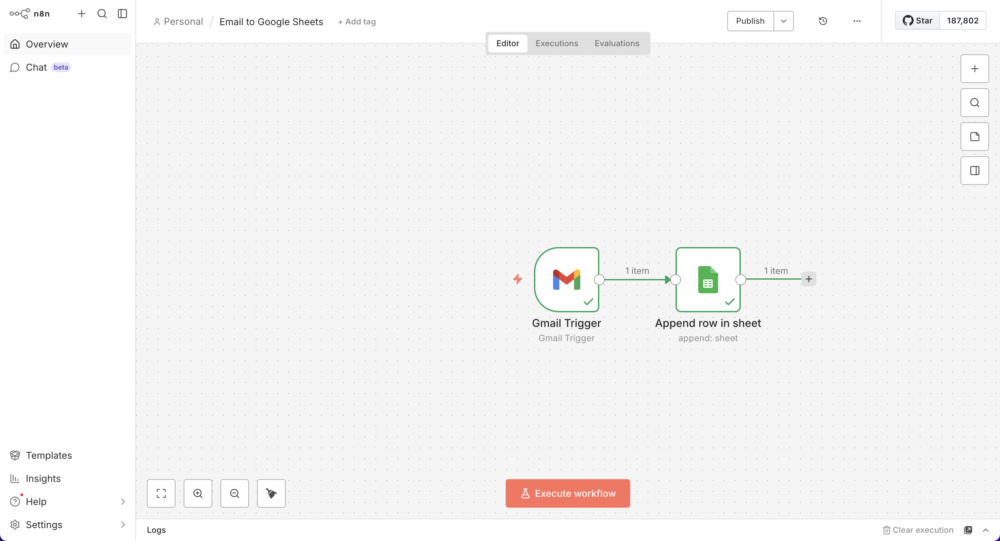
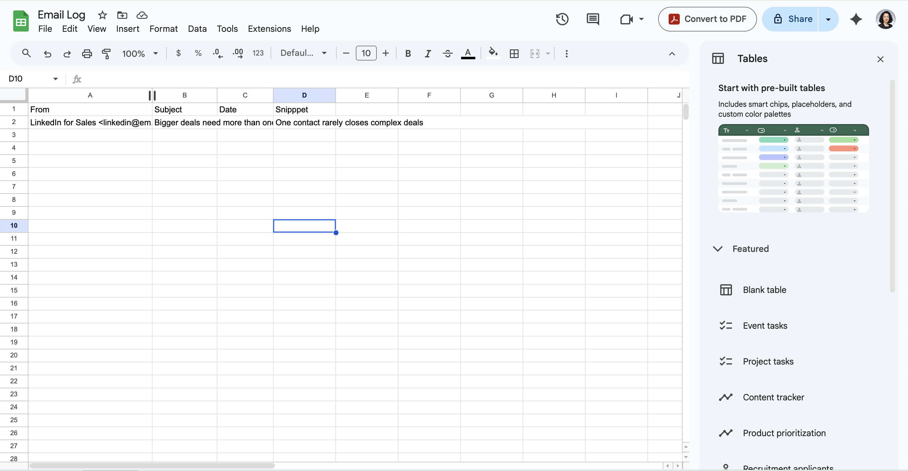
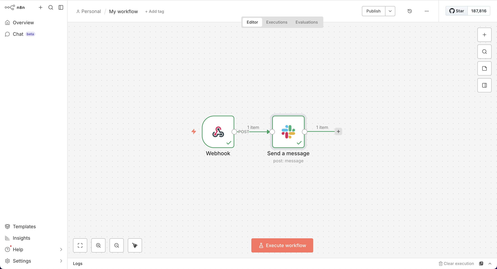
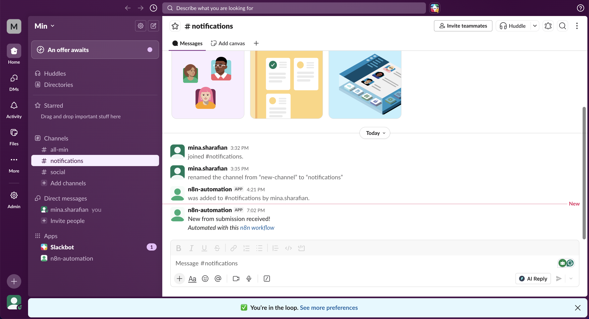

# n8n Automation Portfolio

A collection of business process automation workflows built with **n8n**, demonstrating real-world use cases in e-commerce operations, team notifications, and data management.

-----

## Workflow 1: Email to Google Sheets

**What it does:** Automatically logs incoming Gmail messages into a Google Sheets spreadsheet — no manual data entry required.

**Tools used:** Gmail · Google Sheets · n8n

**Use case:** Tracking customer inquiries, support requests, or order confirmations in a structured, searchable format.

-----

## Workflow 2: Webhook to Slack Notification

**What it does:** Listens for incoming form submissions via Webhook and instantly sends a notification to a Slack channel.

**Tools used:** Webhook · Slack · n8n

**Use case:** Real-time team alerts when a new support ticket, lead form, or internal request is submitted.

-----

## About

These workflows were built as part of a hands-on automation portfolio to demonstrate practical skills in:

- Process automation using n8n
- API integrations (Gmail, Google Sheets, Slack)
- Workflow design and cross-tool data mapping

**Built by:** Mina Sharafian  
**Tools:** n8n · Google Workspace · Slack  
**GitHub:** [Minsh85](https://github.com/Minsh85)
